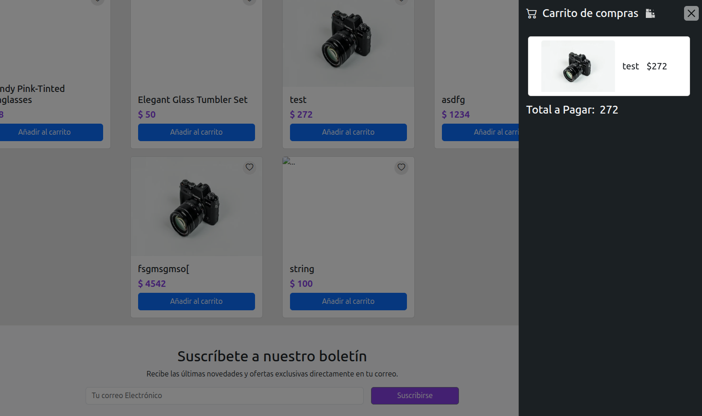

# Carrito de Compras - Tienda en Línea

## Descripción

Este proyecto es un carrito de compras para una tienda en línea desarrollado con tecnologías básicas: HTML, CSS, Bootstrap y JavaScript puro. Permite a los usuarios seleccionar productos, modificar cantidades, eliminar artículos y ver el total actualizado en tiempo real.

El objetivo es brindar una experiencia simple y funcional para gestionar compras.

## Características

- Listado de productos con imagen, nombre, precio y descripción.
- Agregar productos al carrito con cantidad personalizada.
- Modificar cantidades o eliminar productos del carrito.
- Cálculo y actualización automática del total de la compra.
- Interfaz responsiva usando Bootstrap para adaptarse a móviles y escritorio.
- Persistencia del carrito durante la sesión (uso opcional de `localStorage`).

## Tecnologías

- HTML5 para la estructura de la página.
- CSS3 y Bootstrap 5 para el diseño y estilos responsivos.
- JavaScript puro para la lógica del carrito y manipulación del DOM.

